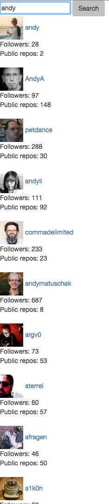

Github Profile
=================

Challenge:
-------

This week's project is to create a simple Github Profile app purely in JavaScript that grabs data from the Github API in order to display a specified users avatar, number of followers and number of repos.

Technologies Used:
-------

- AngularJS (In software development, AngularJS (commonly referred to as "Angular") is an open-source web application framework maintained by Google and by a community of individual developers and corporations to address many of the challenges encountered in developing single-page applications. It aims to simplify both the development and the testing of such applications by providing a framework for client-side model–view–controller (MVC) architecture, along with components commonly used in rich Internet applications).
- Tested using Karma (a JavaScript test-runner built with Node.js, and meant for unit testing).

Next Steps:
-------

- We left some duplications in the test, using 'items' twice - how can we refactor that?
- Notice how when you clear the text box you're still trying to search.
- Add a label to let the user know what they have just searched for.
- Do you have a bug where some of the avatars are blown up really huge?
- Complete versions 1-5 as described in below link.

Links:
-------

[GitHub - Makers Academy: Github Profiles (Further Javascript)](https://github.com/makersacademy/course/blob/master/further_javascript/github_profiles.md)

Images:
-------

- Search for: 'andygout'

- Search for: 'andy'
